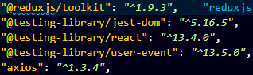
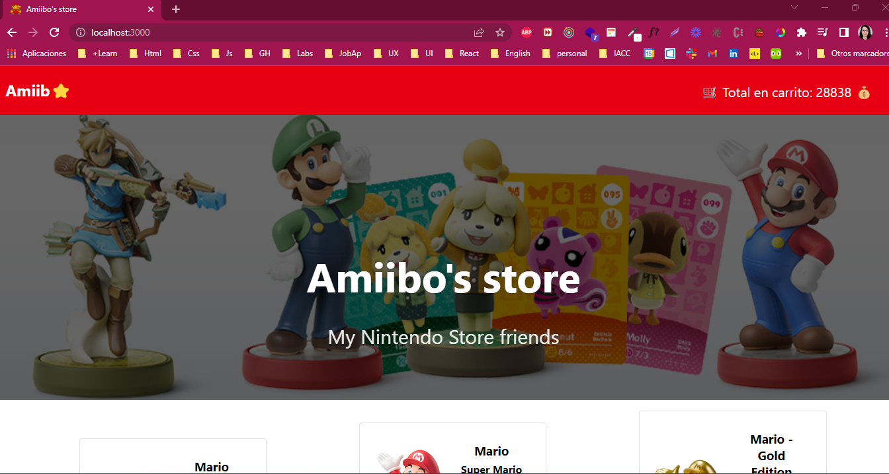
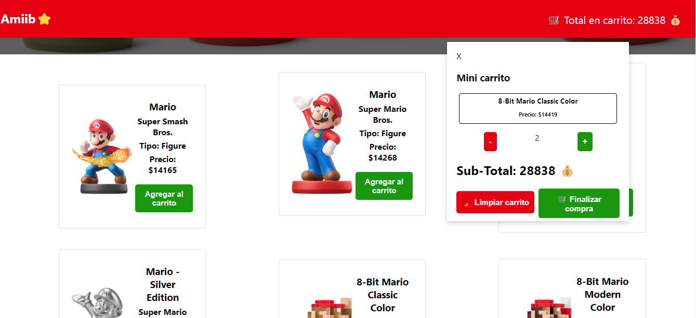
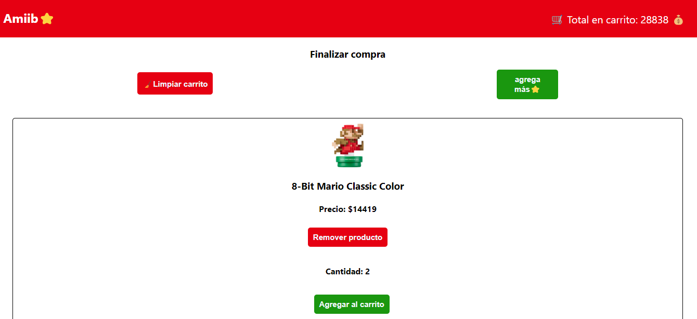

# Proyecto: Gestión de carrito de compras - Amiib⭐'s Store

## Descripcion de la solución
## ¿Qué hace el proyecto? 
 
 Amiibo's store es una tienda, amiga o colaboradora de la Nintendo store que le permite a los usuarios/as revisar el listado completo de Amiibos disponibles 
 en nuestra base de productos y así como  agregar sus Amiibos favoritos a un carrito de compras. Existe un mini carrito que incluye un resumen del mismo y el detalle del carrito completo, permitiendole al usuario en todo momento las opciones de limpiar el carrito, que elimina los productos seleccionados, o por otro lado la opción de seguir comprando. que te devuelve a la vista general de la selección de Amiibos disponibles. 

 El flujo completo de Amiibo's Store esta inspirado en los colores de Nintendo así como el personaje de Super Mario, de modo que los usuarios de la misma se sientan cómodos con una interfaz que simule un video juego. 

## Instalación del Proyecto: 

para poder instalar y hacer correr el proyecto en nuestro local es necesario: 

- clonar 
- abrir  
- iniciar con el comando: `npm install` en la carpeta raíz para instalar las dependencias necesarias 
- uso del comando: `npm start` para dar inicio al mismo y visualizarlo en el navegador de preferencia

## Dependencias:  

Las dependencias o librerías utilizadas son: 

- Axios 
- react-router-dom 

Las que se pueden observar en la siguiente imagen: 

 

## Rutas: 

Respecto al manejo de las rutas este se realizó con la librería `react-router` y las rutas a las que se puede acceder son: 

- una ruta inicial o Home ("/")
- ruta carrito de compras ("/carrito")

observación: el mini carrito es desplegable, por lo cual es posible acceder a el desde el home o desde el carrito checkout, debido a que este nace en el componente navbar pudiendo visualizarse con un hover sobre el carrito. 

## Consultas a API: 

La api consultada es: https://amiiboapi.com/api/amiibo/

Para la realización de consultas de productos se realiza con `Axios`, esto se realiza de manera centralizada con el uso de `Redux`, más detalles se describen continuación. 
## Manejo del estado: 

Considerando las caracteristicas del desafío así como el manejo de la data necesaria para el desarrollo del proyecto, se hizo uso de la librería `redux` lo que se justifica al considerar que en un proyecto de eCommerce, la gestión del estado de la aplicación puede ser especialmente compleja debido a la gran cantidad de información que se debe manejar. Al utilizar Redux, se pueden aprovechar las ventajas de esta biblioteca para simplificar y organizar la gestión del estado de la aplicación, dentro de las razones que lo justifican además se encuentra que:  

 Potencia el manejo del carrito de compras, que es un componente crítico en una tienda en línea y su estado debe ser gestionado de forma efectiva. Al utilizar Redux, se puede almacenar el estado del carrito de compras en el store y actualizarlo de forma consistente en toda la aplicación.

## Estilos: 

Toda el desafío fue desarrollado solo a partir de hojas de estilo en cascada `Css`, sin uso de frameworks. 

## Visualización

- De forma general, se logra visualizar de la siguiente manera:

- El mini carrito se puede apreciar:

- Finalmente, el carrito se puede observar con la siguiente imagen adjunta:

 

- Puedes visitar Amiibo's store directamente siguiendo el siguiente enlace:
  https://amiibos-store.vercel.app/
 

### Camila Serantoni R. 

